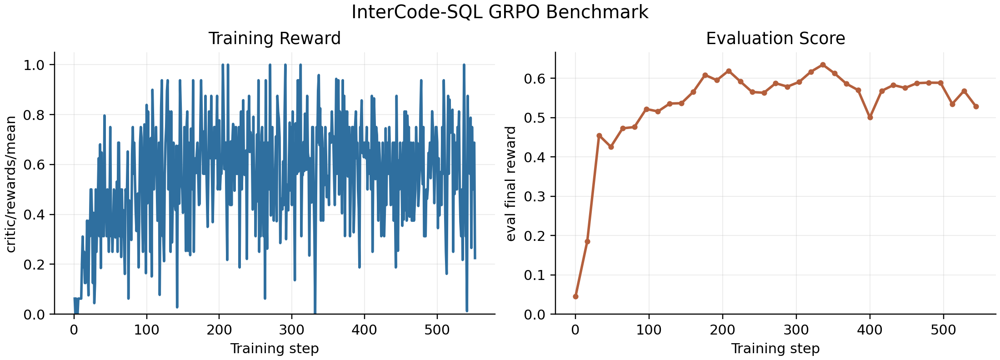

# InterCode-SQL Benchmark Results

## 1. Task Introduction

[InterCode-SQL](https://github.com/princeton-nlp/intercode) is an interactive text-to-SQL benchmark where an agent answers natural-language database questions by issuing SQL commands to a live MySQL environment.

The environment is configured as follows:
* Environment: InterCode `SqlEnv` with the Spider dev database dump
* Action Space: MySQL statements and `submit`
* Reward Structure: final reward returned by InterCode `SqlEnv`
* Maximum Steps: 10 environment steps

The example data script downloads the official InterCode Spider dev file and builds a fixed local split with 834 training tasks and 200 test tasks:

```bash
python examples/grpo_intercode_sql/get_intercode_sql_data.py
```

## 2. Experimental Settings

We evaluate InterCode-SQL with the Trinity-RFT GRPO example in `examples/grpo_intercode_sql`. The run uses `Qwen/Qwen2.5-7B-Instruct` as the policy model.

Key parameters:
* `batch_size=8`
* `repeat_times=4`
* `lr=1e-6`
* `max_prompt_tokens=7680`
* `max_response_tokens=2048`
* `max_env_steps=10`
* eval split: 200 test tasks with `repeat_times=1`

## 3. Results and Analysis

The figure below shows the training reward and evaluation score curves from the same run.



The training reward is noisy because it is measured on sampled rollout batches, while the evaluation score is computed on the fixed 200-task test split. Evaluation improves from `0.0450` at step 0 to a best score of `0.6345` at step 336. The last logged evaluation score is `0.5286` at step 544.

| Metric | Step | Value | Elapsed Time (Hours) |
|--------|------|-------|----------------------|
| Best eval score | 336 | 0.6345 | 1.87 |
| Last eval score | 544 | 0.5286 | 3.71 |


The following table reports the wall-clock time required to reach selected evaluation thresholds.

| Target Eval Score | Step | Reached Score | Time to Reach Target (Hours) |
|-------------------|------|---------------|------------------------------|
| 0.2 | 32 | 0.4549 | 0.17 |
| 0.4 | 32 | 0.4549 | 0.17 |
| 0.5 | 96 | 0.5218 | 0.51 |
