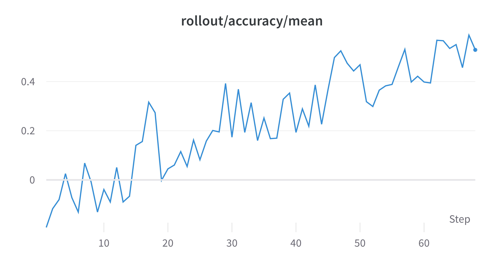
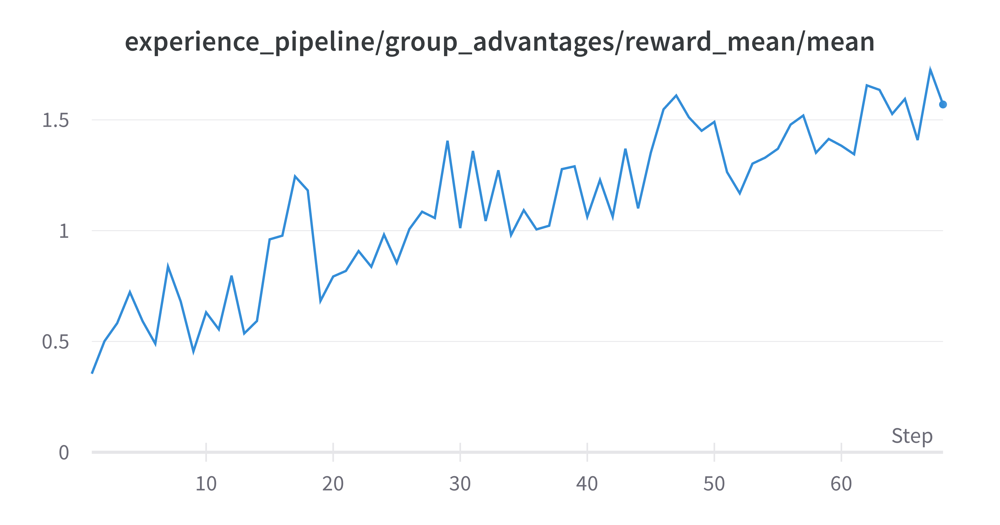
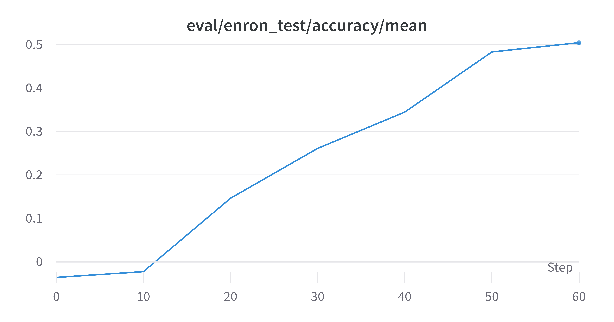

# 邮件搜索例子

这个示例展示了一个多轮邮件搜索工作流，内容参考自 [ART](https://openpipe.ai/blog/art-e-mail-agent?refresh=1756431423904)。我们实现了一个 ReAct Agent，并定义了用于邮件搜索的工具。注意：此示例需要安装 [AgentScope](https://github.com/agentscope-ai/agentscope?tab=readme-ov-file#-installation)。

## 核心组件

我们需要定义一些组件：

-   `EmailSearchWorkflow`：协调整个流程的主类。它负责初始化环境、管理 Agent 并执行任务。
-   `EmailSearchAgent`：操作的“大脑”。
    *   接收用户的查询和系统提示。
    *   决定采取哪些操作（例如使用哪个工具）。
    *   基于 `AgentScope` 框架构建。
-   **工具（Tools）**：Agent 可调用以与环境交互的函数。根据代码，这些工具可能包括：
    *   `search_email`：查找相关邮件。
    *   `read_email`：读取特定邮件的内容。
    *   `generate_response`：在找到答案后生成最终回复。该工具可继承自 `AgentScope` 框架。
-   **Judge LLM**：用于评估 Agent 表现的评判模型，通过 `auxiliary_models` 定义。

## 运行实验

### 第一步：准备数据

运行以下命令准备数据：

```bash
python trinity/common/workflows/envs/email_searcher/prepare_data.py
```

如果你想选择一个新的数据库路径，可以修改 [`prepare_data.py`] 中的 `DEFAULT_DB_PATH`。此外，在进入下一步之前，请记得设置环境变量 `DEFAULT_EMAIL_DB_PATH` 指向该数据库路径。

### 第二步：运行工作流

配置文件位于 [`email_search.yaml`](https://github.com/modelscope/Trinity-RFT/tree/main/examples/grpo_email_search/email_search.yaml)。
要运行此示例，可执行以下命令：

```bash
trinity run --config examples/grpo_email_search/email_search.yaml
```

## 评估结果

结果如下图所示（准确率范围为 -0.1 到 1.0）：






