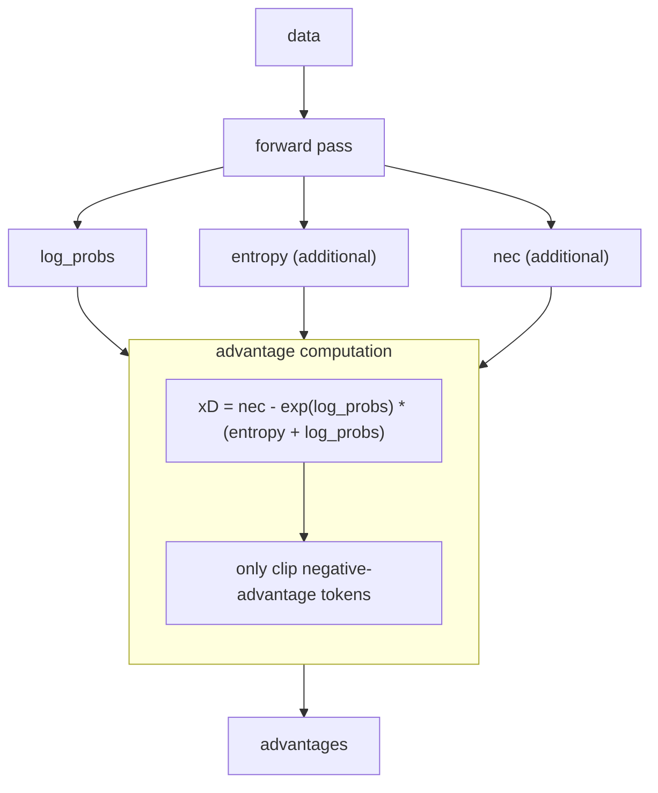

# Entropy dynamics of RL training

This example shows the two algorithms **Clip_B** and **Clip_V** from the work [On the Entropy Dynamics in Reinforcement Fine-Tuning of Large Language Models](https://arxiv.org/pdf/2602.03392).

NOTE: This example is only tested on trinity==0.5.1 and verl==0.7.0. The following experiments require `synchronizer.sync_interval=1` and `trainer.trainer_config.algorithm.rollout_correction.bypass_mode=false` to be set.

We also provide a runnable branch in the [Trinity-RFT](https://github.com/hiyuchang/Trinity-RFT/tree/example/entropy) repository that already includes all patches for this example.

## Data Preparation

We utilize the [DAPO-Math-17k](https://huggingface.co/datasets/open-r1/DAPO-Math-17k-Processed) dataset as our training set. We exclude 500 questions from the training set to form the validation set (denoted by dapo-validation-500).
The training set is filtered out samples from the training set with excessively high (≥ 15/16) or low (≤ 1/16) pass rates, as evaluated by Qwen2.5-7B-Instruct.

## Clip_B Experiment

1. Apply the patch to keep entropy information in the trainer batch:

```bash
cd /path/to/Trinity-RFT
git apply examples/entropy/clipb_trainer.patch
# if not successful, try:
# git apply --3way --ignore-whitespace examples/entropy/clipb_trainer.patch
```

2. Update the dataset paths and other configurations in the file [`clipb.yaml`](./clipb.yaml) to point to your local data.

3. Run the experiment:

```bash
trinity run examples/entropy/clipb.yaml
```

## Clip_V Implementation

1. Apply the patch to keep entropy information in the trainer batch:

```bash
cd /path/to/Trinity-RFT
git apply examples/entropy/clipv_trainer.patch
# if not successful, try:
# git apply --3way --ignore-whitespace examples/entropy/clipv_trainer.patch
```

2. Update the dataset paths and other configurations in the file [`clipv.yaml`](./clipv.yaml) to point to your local data.

3. Run the experiment:

```bash
trinity run examples/entropy/clipv.yaml
```

### Logic of Clip_V

As shown in the following flowchart, the forward pass of [examples/entropy/clipv_dp_actor.py](./clipv_dp_actor.py) outputs `log_probs`, `entropy`, and `nec`.
These signals are then used by [Clip_V advantage function](../../trinity/algorithm/advantage_fn/clipv_advantage.py) to compute `xD` and clip only negative-advantage tokens. This process returns the revised `advantages`.


