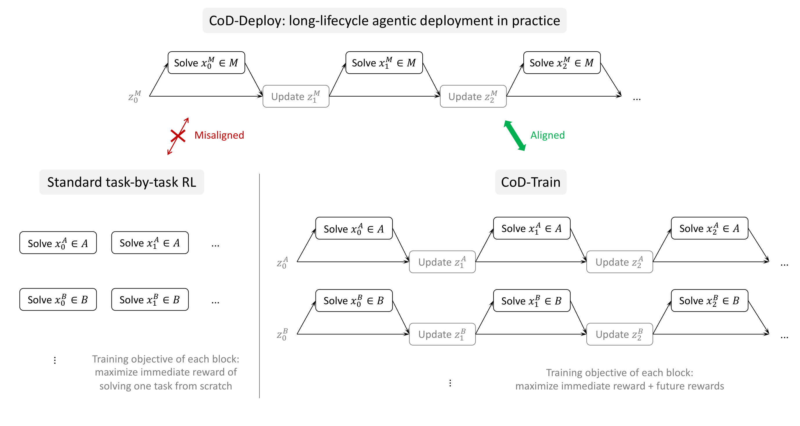
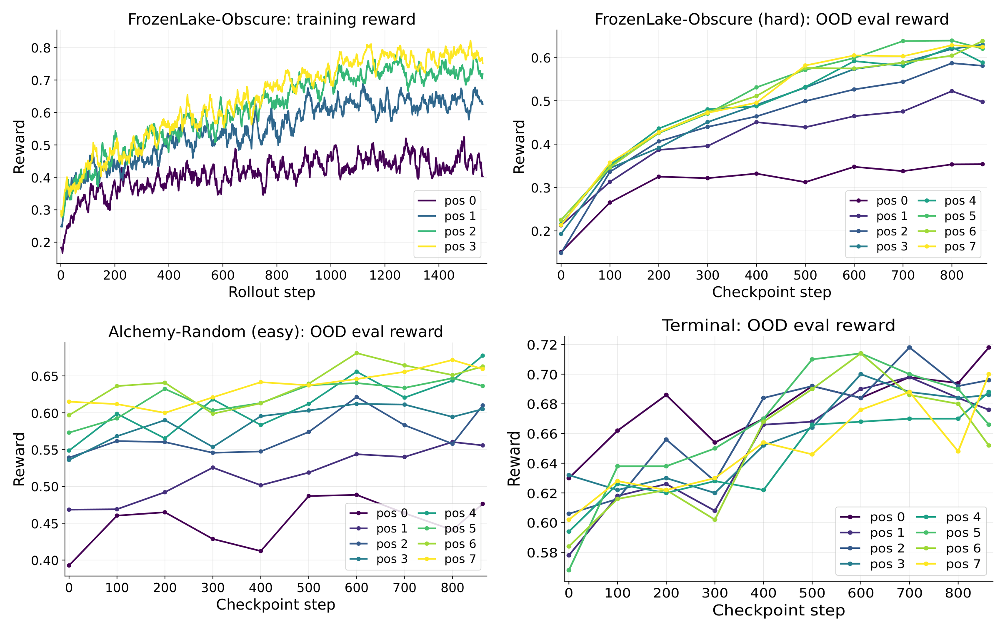

[**English**](README.md) | **中文**

# Connect the Dots (CoD)

**用端到端 RL 训练 LLM 在长生命周期 agentic 部署中“连点成线”（Connect the Dots）。**

当 LLM agent 部署到一个环境中，它会连续解决一长串任务，同时不断探索环境、从自身经验中学习、迭代地自我更新关于环境的 context，后续任务在更新后的 context 条件下越解越好。

CoD 把相关任务打成一个 pack（任务包），作为一条交替进行**解决任务（solve-task）**与**更新 context（update-context）**回合的长序列展开：每解完一个任务，模型就根据刚发生的事更新 context（一段简短的 `Hints:` 块），靠后的任务在累积的 context 条件下求解。
整个 pack 用 RL 端到端训练，细粒度的信用分配让“使后续任务更好解的 context 更新”获得奖励。
训练好的模型 reward 随 pack 位置递增，这正是 CoD 元能力被激发出来的标志。

> **完整实现在 [`research/cod`](https://github.com/agentscope-ai/Trinity-RFT/tree/research/cod/examples/research_cod) 分支**，请切到该分支查看或运行完整代码。

<p align="center">
  
  <br><sub><em>图 1：CoD 总览。相关任务打成 pack，作为交替的 solve-task 与 update-context 回合展开，端到端训练（CoD-Train），部署到新环境时套用同样的循环（CoD-Deploy）。</em></sub>
</p>

---

## 工作原理

```
pack = [ task0, task1, task2, task3 ]      # 同一 taskset 的一包相关任务(大小 = task_pack_size,图中以 4 示意)

 task0  --求解(无 hint)-->     reward0, feedback0  --生成 hint-->  hint1
 task1  --求解(用 hint1)-->    reward1, feedback1  --生成 hint-->  hint2
 task2  --求解(用 hint2)-->    reward2, feedback2  --生成 hint-->  hint3
 task3  --求解(用 hint3)-->    reward3
```

- **Pack**：来自同一 taskset 的相关任务被分到一包，大小由 `task_pack_size`（训练）/ `eval_task_pack_size`（评测）决定，分组在 `pack_tasks()` 里完成。
- **位置（position）**：任务在 pack 中的序号；位置 k 带着前 k 个任务蒸馏出的 hint 来求解，所以位置越靠后，代表模型在上下文里已经学到越多。
- **任务奖励**：图里每个 task_i 解完得到的 reward，来自环境（答对 / 答错，或按质量打分），并扣掉过长解答、过长 hint 的长度惩罚（鼓励简洁）。
- **迭代 hint**：每解完一个任务，模型就基于 `(上一段 hint, 轨迹, reward, feedback)` 更新作为 context 的 `Hints:` 块，下一题求解时把它拼到 prompt 最前面。
- **细粒度信用分配（reward-to-go）**：遵循经典动态规划原理，每个回合（解题、更新 context）的回报由当前与未来任务的奖励构成。一次 context 更新在帮到后续任务时会得到更高得分，模型于是学着写出有用的 hint。

核心评估指标：`reward_iterative_hint_e2e_taskset_{ts}_pos_{pos}`，即每个 pack 位置的平均 reward；位置越靠后、reward 越高，就是 CoD 效应。

<p align="center">
  
  <br><sub><em>图 2：CoD 效应。reward 随 pack 位置上升，训练时如此，OOD 评测时也如此，包括 in-domain（更难的 FrozenLake）与 cross-domain（Alchemy、Terminal）。</em></sub>
</p>

---

## 环境

每个环境里，一个 pack 的任务之间都有可复用的东西：有时是隐藏的规律（动作映射、合成配方），有时是解题策略或踩过的坑。模型在与环境的交互和反馈中把它摸清，写进 hint，再带给 pack 内后面的任务。

| 环境 | `default_workflow_type` | pack 内可迁移的知识 |
|---|---|---|
| FrozenLake-Obscure | `cod_frozenlake_obscure_workflow` | 隐藏的动作映射，代号 1–4 各代表哪个移动方向 |
| Alchemy-Random | `cod_random_alchemy_workflow` | 隐藏的合成配方，哪些元素能组合出哪个新元素 |
| Terminal | `cod_terminal_workflow` | 命令、路径的用法与易踩的坑，以及文件大致在哪 |
| Learn2Ask | `cod_learn2ask_workflow` | 何时继续追问、何时停下来给诊断 |

各环境的 workflow 实现位于 `research/cod` 分支的 [`trinity/common/workflows/connect_the_dots/`](https://github.com/agentscope-ai/Trinity-RFT/tree/research/cod/trinity/common/workflows/connect_the_dots)。

---

## 运行

```bash
git clone -b research/cod https://github.com/agentscope-ai/Trinity-RFT.git
cd Trinity-RFT
conda create -n trinity python=3.12 && conda activate trinity
pip install -e ".[vllm,flash_attn]"
```

**1. 生成数据**
```bash
# FrozenLake-Obscure
python examples/research_cod/get_frozen_lake_data.py --local_dir examples/research_cod/data/frozen_lake_4567 \
    --train_size 50000 --test_size 4000 --map_min_size 4 --map_max_size 5 --tile_min_prob 0.6 --tile_max_prob 0.7
python examples/research_cod/get_frozen_lake_data.py --local_dir examples/research_cod/data/frozen_lake_6767 \
    --train_size 50000 --test_size 4000 --map_min_size 6 --map_max_size 7 --tile_min_prob 0.6 --tile_max_prob 0.7
# Alchemy-Random
python examples/research_cod/get_alchemy_data.py --local_dir examples/research_cod/data/alchemy_random --train_size 50000 --test_size 4000 --seed 42
# Terminal
python examples/research_cod/get_terminal_data.py --local_dir examples/research_cod/data/terminal --train_size 50000 --test_size 4000 --seed 42 --composite_ratio 0.5
```

**2. 训练**
```bash
# FrozenLake-Obscure
trinity run --config examples/research_cod/exp_plan_final/train/frozen_lake_obscure.yaml
# Mixed（FrozenLake-Obscure + Alchemy-Random 联合训练）
trinity run --config examples/research_cod/exp_plan_final/train/mixed_flobs_alchran.yaml
```

**3. 评测**（逐 checkpoint 衡量 OOD 泛化：同域更难版本 + 跨域未见环境）
```bash
# FrozenLake-Obscure ckpt → 同域 FrozenLake-hard，跨域 Alchemy-easy / Terminal
bash examples/research_cod/exp_plan_final/bench/run_eval.sh --train-tasks frozen_lake_obscure
# Mixed ckpt → 同域 FrozenLake-hard，跨域 Alchemy-hard / Terminal
bash examples/research_cod/exp_plan_final/bench/run_eval.sh --train-tasks mixed_flobs_alchran
```

---

## 引用

```bibtex
@article{chen2026connect,
  title={Connect the Dots: Training Large Language Models for Long-Lifecycle Agentic Deployment Via Reinforcement Learning},
  author={Chen, Yanxi and Shi, Weijie and Xie, Yuexiang and Hu, Boyi and Li, Yaliang and Ding, Bolin and Zhou, Jingren},
  journal={arXiv preprint},
  year={2026}
}

@article{pan2025trinity,
  title={Trinity-rft: A general-purpose and unified framework for reinforcement fine-tuning of large language models},
  author={Pan, Xuchen and Chen, Yanxi and Chen, Yushuo and Sun, Yuchang and Chen, Daoyuan and Zhang, Wenhao and Xie, Yuexiang and Huang, Yilun and Zhang, Yilei and Gao, Dawei and others},
  journal={arXiv preprint arXiv:2505.17826},
  year={2025}
}
```
